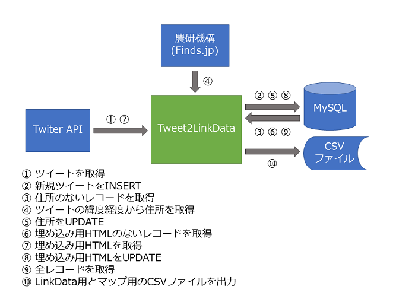

# Tweet2LinkData

## 概要
Tweet2LinkDataは、ツイートを用いた参加型オープンデータの収集・公開基盤です。
特定のハッシュタグと位置情報の付いたツイートを定期的に収集してデータベースに格納します。
収集したデータは、LinkData.orgと地図サイトで公開することができます。

## 内容
### admin
#### createtable.sql
MySQLにテーブルを作成するスクリプトです。

#### tweet2linkdata.php
ツイートを収集してデータベースに格納し、オープンデータ公開用とマップ公開用のCSVファイルを出力するPHPスクリプトです。cron等を使用して定期的に実行します。別途、[TwitterOAuth](https://github.com/abraham/twitteroauth)が必要です。

#### linkdata.xlsx
LinkData.orgでオープンデータを公開するための雛形ファイルです。

### map
収集したツイートをマッピングして公開するためのWebアプリです。地図上に示されたマーカーをクリックするとツイートをポップアップ表示します。

以下のOSSを利用しています。

* [Leaflet](http://leafletjs.com/) (2-Clause BSD)
* [Leaflet.markercluster](https://github.com/Leaflet/Leaflet.markercluster) (MIT license)
* [Leaflet.Locate](https://github.com/domoritz/leaflet-locatecontrol) (MIT license)
* [Leaflet.EasyButton](https://github.com/CliffCloud/Leaflet.EasyButton) (MIT license)
* [leaflet-omnivore](https://github.com/mapbox/leaflet-omnivore) (BSD license)
* [Leaflet.ExtraMarkers](https://github.com/coryasilva/Leaflet.ExtraMarkers) (MIT license)
* [Bootstrap](http://getbootstrap.com/) (MIT license)
* [jQuery](http://jquery.com/) (MIT license)
* [Font Awesome](https://fortawesome.github.io/Font-Awesome/) (SIL OFL 1.1)

## 動作環境
* Webサーバ
* PHP
* MySQL

## 利用例
#### 月待ビンゴ
[月待ビンゴ](https://moon.midoriit.com)はTweet2LinkDataを用いてツイートを収集し、[GitHub](https://github.com/midoriit/tsukimachito)と[マップ](https://moon.midoriit.com/map/)でデータを公開しています。

#### 狛犬ツイートマップ
[狛犬ツイートマップ](https://komainu.midoriit.com)は、Tweet2LinkDataを用いて収集したツイートをマップに表示しています。InstagramアプリによるTwitterとInstagramへの同時投稿では、ツイートではなくInstagramの投稿をポップアップ表示するよう機能拡張してあります。

## 注意事項
Twitter APIを利用するために、Twitterのユーザアカウントとアプリケーション登録が必要です。

所在地の地名は、ツイートの緯度経度から、農研機構の[簡易逆ジオコーディングサービス](http://www.finds.jp/rgeocode/index.html.ja)を用いて取得しています。
* 当該サービス提供者は、当該サービスを無保証で提供しており、当該サービスが原因で発生した損害等について、補償等は一切おこないません。
* 当該サービス提供者は、当該サービスを原因とする不具合があった場合でも、成果物に関する直接的なサポートを行いません。

## ライセンス
この 作品 は [クリエイティブ・コモンズ 表示 - 継承 4.0 国際 ライセンス](http://creativecommons.org/licenses/by-sa/4.0/)の下に提供されています。
